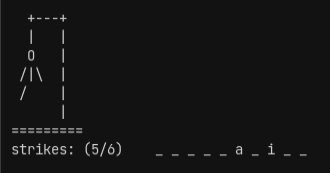

# Hangman
A command line Hangman game where a player tries to guess the word.
A key feature being the save and load game mechanic.

U can check out the project details [here](https://www.theodinproject.com/lessons/ruby-hangman)

# Play it yourself
[Click here](https://replit.com/@SankalpGawali/Hangman) for a live version!

Or clone the repo and run hangman.rb to play it locally

# Features
- Grabs a random word from given dictionary
- Player can save and quit on any turn
- Player can load save file on startup
- Uses JSON format for serialization
