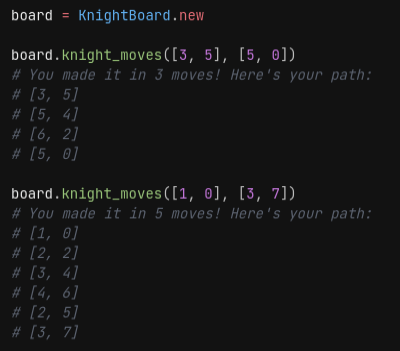

# Knight Travails
A Chess knight can travel from any square on the board to any other square
The task is to build a function #knight_moves that shows the shortest possible way to get from one square to another by outputting all squares the knight will stop on along the way.

U can check out the project details [here](https://www.theodinproject.com/lessons/ruby-knights-travails)

## Try it yourself
Clone the repo and run knight_travails.rb

U can edit the file and change the function call at the bottom to try different coordinates to see different paths.

## Features
My solution involves using a breadth first algorithm for path finding from one coordinate to another

- Board made of interconnected nodes
- Path finding algorithm to find shortest path between nodes