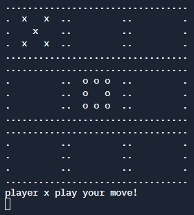

# Tic Tac Toe
A tic-tac-toe game on the command line where two human players can play against each other

U can check out the project details [here](https://www.theodinproject.com/lessons/ruby-tic-tac-toe-manager)

## Play it yourself
[Click here](https://replit.com/@SankalpGawali/tictactoe) for a live version!
Or clone the repo and run tic_tac_toe.rb to play it locally

type the row number and column number separated by a space to play your move
for e.g. '1 2', '2 3', '2 1'

### Concepts used
- Classes and instance variables
- input validation and error handling
